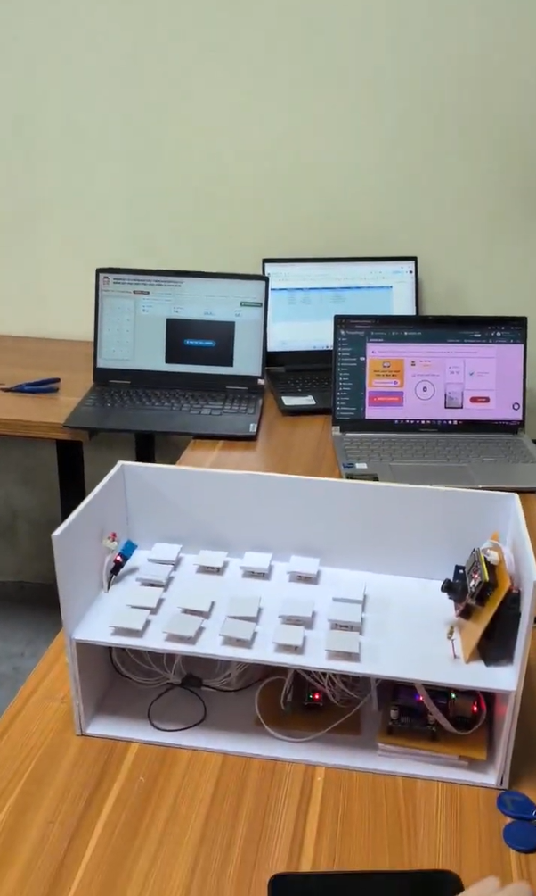

# Research and Implementation of an Identification and Monitoring System for Primary School Students on School Shuttle Buses

Hệ thống IoT giám sát học sinh trên xe đưa đón. Sử dụng STM32F4 làm Master phối hợp ESP32-S3 xử lý Edge AI nhận diện khuôn mặt. Tích hợp RFID, cảm biến ghế và module SIM 4G cảnh báo khẩn cấp. Quản lý dữ liệu tập trung qua nền tảng ThingsBoard và Google Sheets.

## 🎥 Video Demo
[](https://youtu.be/z53JZ541N3Y?si=kEnjyrutjtcwe4ZM)
*(Nhấn vào hình ảnh trên để xem chi tiết video demo hệ thống)*

## ✨ Tính năng nổi bật
- **Điểm danh thông minh tự động:** Ghi nhận học sinh lên/xuống xe thông qua công nghệ quét thẻ không tiếp xúc RFID, tự động đồng bộ thời gian và danh tính lên Google Sheets.
- **Xử lý Edge AI - Trí tuệ nhân tạo tại biên:** Sử dụng ESP32-S3 kết hợp camera OV2640 chạy mô hình mạng nơ-ron (CNN) để nhận diện khuôn mặt và đếm số lượng người trực tiếp trên thiết bị với độ trễ thấp.
- **Chống bỏ quên học sinh (An toàn dự phòng):** Giám sát liên tục trạng thái ghế ngồi (cảm biến tải trọng) kết hợp so sánh với sĩ số điểm danh. Tự động kích hoạt quy trình khẩn cấp nếu phát hiện học sinh còn sót lại khi tài xế đã tắt máy rời xe.
- **Cảnh báo khẩn cấp đa lớp (Multi-layer Alert):** - *Cảnh báo tại chỗ:* Kích hoạt còi hú và loa thông báo bằng giọng nói tiếng Việt (thông qua module giải mã DFPlayer).
  - *Cảnh báo từ xa:* Đẩy thông báo tức thời lên Cloud Dashboard và tự động nhắn tin SMS/gọi điện trực tiếp vào số phụ huynh, tài xế qua module mạng di động SIM 4G.
- **Giám sát môi trường & thời gian thực:** Cập nhật liên tục nhiệt độ, độ ẩm trên xe và sĩ số hành khách lên giao diện ThingsBoard. Hỗ trợ Local Web Server cho phép tài xế quan sát camera nội bộ không cần Internet.

## 🛠 Công nghệ & Phần mềm sử dụng
Dự án được nghiên cứu, thiết kế phần cứng và phát triển phần mềm thông qua các công cụ:
- **Thiết kế phần cứng (PCB & Schematic):** Altium Designer.
- **Lập trình Vi điều khiển:** STM32CubeMX, STM32CubeIDE, KeilC (cho dòng STM32) và Arduino IDE (cho ESP32).
- **Nền tảng Cloud & Web:** ThingsBoard (IoT Dashboard), Google Apps Script (lập trình xử lý dữ liệu Google Sheets), HTML/CSS/JS (Web Server nội bộ).
- **Giao thức truyền thông mạng:** MQTT, HTTP.
- **Giao thức giao tiếp phần cứng:** UART, I2C, SPI.

## 🧩 Các thành phần phần cứng (Hardware Components)
Dự án được module hóa thành các Node chức năng riêng biệt, bao gồm:
- **Khối xử lý trung tâm (Master):** Vi điều khiển STM32F411CEU6 chịu trách nhiệm điều phối toàn bộ logic hệ thống.
- **Khối xử lý AI & Hình ảnh (Node 1):** ESP32-S3 kết hợp Camera góc rộng OV2640.
- **Khối Nhận diện & Âm thanh (Node 2):** Vi điều khiển STM32F103C8T6 giao tiếp đầu đọc thẻ RFID RC522 và module phát giọng nói DFPlayer Mini.
- **Khối Cảm biến Môi trường (Node 3):** STM32F103C8T6 đọc dữ liệu từ cảm biến nhiệt độ/độ ẩm DHT11 và ma trận cảm biến nút nhấn mô phỏng trạng thái ghế ngồi.
- **Khối Truyền thông Internet:** ESP32 DevKit (đẩy dữ liệu WiFi) và Module SIM A7680S (duy trì kết nối và cảnh báo qua mạng 4G LTE).
- **Khối Quản lý nguồn:** Module hạ áp xung LM2596 (chuyển đổi 12V DC xuống 5V và 3.8V an toàn cho mạch).

## 📂 Cấu trúc thư mục (Repository Structure)
```text
📦 He-Thong-Giam-Sat-Xe-Dua-Don
┣ 📂 Altium_design        # File thiết kế phần cứng, sơ đồ nguyên lý mạch in (PCB, Schematic)
┣ 📂 CODE_App_Script      # Mã nguồn Google Apps Script quản lý cơ sở dữ liệu trên Google Sheets
┣ 📂 CODE_NODE1           # Code xử lý AI trên ESP32-S3 (Face detect, Camera Stream, Web Server)
┣ 📂 CODE_NODE2           # Code nạp cho STM32F1 (Xử lý mã thẻ RFID, phát file âm thanh MP3)
┣ 📂 CODE_NODE3           # Code nạp cho STM32F1 (Đọc tín hiệu cảm biến môi trường, tải trọng ghế)
┣ 📂 CODE_NODE_MASTER     # Code điều khiển trung tâm (STM32F4) xử lý luồng logic & Module SIM
┣ 📂 CODE_Thingsboard     # File cấu hình, luồng xử lý liên quan đến giao diện ThingsBoard
┣ 📂 image                # Thư mục lưu trữ hình ảnh minh họa cho báo cáo và file README
┣ 📂 report               # Tài liệu báo cáo lý thuyết, tính toán thiết kế của dự án (PDF/Word)
┣ 📜 .gitattributes       
┣ 📜 LICENSE              
┗ 📜 README.md
